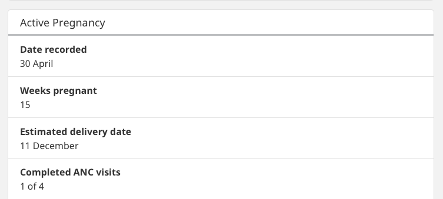

# Contact Summary

In the `app_settings.contact_summary` you can write a script to output fields for the contact info pane and help decide which reports should be able to be filed against a contact. The script is evaluated as JavaScript so all the standard language features are available.

## Inputs

There are two variables available to you to inspect to generate the summary information:

- `contact` which is the currently selected contact.
- `reports` which is an array of reports for the contact.
- `lineage` which is an array of the contacts parents (added in 2.13.0).

## Outputs

The output of your script is an object with three properties:

### `fields`

An array of fields which summarize the contact and will be shown at the top of the contact pane.


### `cards`

An array of cards to show below the summary, each with their own header and arrays of fields.



### `context`

An object which is passed to each forms `expression` to give more information to decide whether or not to show the form in the "New action" menu.


## Configuration

Each field is an object with the following properties:

- `label` is the translation key to be used for the label.
- `value` is the value to display.
- `width` is how wide out of 12 the field should be shown. Common values are 12 for full width, 6 for half width, or 3 for quarter width.
- `translate` (defaults to false) is whether or not to translate the value, eg: `{ label: "contact.sex", value: "label.male", translate: true }`
- `context` (optional) is for providing translation context for complex values.
- `filter` (optional) is the name of the display filter to apply to the value, eg: `{ value: '2005-10-09', filter: 'age' }` will render as "11 years". 
Common filters are: `age`, `phone`, `weeksPregnant`, `relativeDate`, `relativeDay`, `fullDate`, `simpleDate`, `simpleDateTime`, `lineage`, `resourceIcon`. 
For the complete list of filters, and more details on what each does, check out the code in [`medic-webapp/static/js/filters` dir](https://github.com/medic/medic-webapp/tree/master/static/js/filters).

In 2.13.0 and later the configured function `return`s to supply the output as in the following example. Prior to 2.13.0 to return the result you needed to declare the object on the last line of the script.

### Example

```javascript
var cards = [];
var context = {};
var fields = [];

if (contact.type === 'person') {
  fields = [
    { label: 'patient_id', value: contact.patient_id, width: 3 },
    { label: 'contact.sex', value: contact.sex, width: 3 },
    { label: 'contact.age', value: contact.date_of_birth, width: 3, filter: 'age' },
    { label: 'Phone Number', value: contact.phone, width: 3, filter: 'phone' },
    { label: 'Notes', value: contact.notes, width: 12 },
    { label: 'contact.parent', value: lineage, filter: 'lineage' }
  ];
  var pregnancy;
  var pregnancyDate;
  reports.forEach(function(report) {
    if (report.form === 'pregnancy' || report.form === 'P') {
      var subsequentDeliveries = reports.filter(function(report2) {
        return report2.form === 'D' && report2.reported_date > report.reported_date;
      });
      if (subsequentDeliveries.length > 0) {
        return;
      }
      var subsequentVisits = reports.filter(function(report2) {
        return report2.form === 'V' && report2.reported_date > report.reported_date;
      });
      context.pregnant = true; // don't show Create Pregnancy Report button
      var edd = report.expected_date || report.fields.edd_8601;
      if (!pregnancy || pregnancyDate < report.reported_date) {
        pregnancyDate = report.reported_date;
        pregnancy = {
          label: 'label.pregnancy',
          fields: [
            { label: 'EDD', value: edd, filter: 'relativeDay' },
            { label: 'Visits', value: 'label.visits.of', translate: true, context: { count: subsequentVisits.length, total: 4 } }
          ]
        };
      }
    }
  });
  if (pregnancy) {
    cards.push(pregnancy);
  }
} else {
  fields = [
    { label: 'contact.place.id', value: contact.place_id, width: 12 },
    { label: 'Notes', value: contact.notes, width: 12 }
  ];
}

return {
  fields: fields,
  cards: cards,
  context: context
};
```
