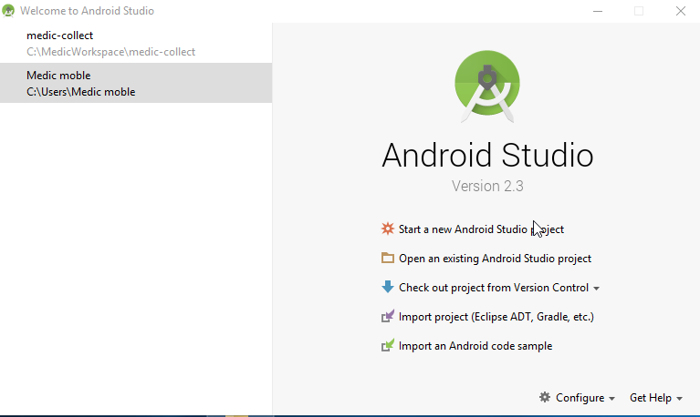

# Creating and Releasing a New Medic Collect Android App

### Step 1: Download Android studio or Eclipse. 
http://askubuntu.com/questions/634082/how-to-install-android-studio-on-ubuntu


Once installed, start Android Studio on Windows, from the Unity Dash(Ubuntu) or just run command

*N:B Run below command as `sudo`*
```sudo /opt/android-studio/bin/studio.sh```


### Step 2: Clone Medic-Collect and open the folder as an existing Android Studio Project
By this time hopefully you have already cloned the `medic-collect` repo. If not, run the command `git clone https://github.com/medic/medic-collect.git`

On Android Studio, we are going to open the `medic-collect` project by navigating to it and clicking on the root folder which will be reprensented on the Android Studio file navigator by an Android Studio Project Icon and then clicking Ok.


Let Gradle build and load project dependencies.


### Step 3: Make sure that the folder to your medic collect flavor has the forms and configuration necessary for medic-collect to build the apk.

Do this by navigating to `medic-workspace/medic-projects/_medic-collect-flavors/`and creating the folder `le_app`.
Copy paste the contents of another collect flavor. Copy from `standard`. This is so that you can maintain the proper folder structure needed. We will replace these contents customise it to `le-app`.

### Step 4. Navigate to build.gradle for Medic-Collect project and add some code to `productFlavors{}` and `sourceSets{}`

Navigate to `build.gradle` as below


To `productFlavors{}` append the code
```
le_app {
            versionName = android.defaultConfig.versionName + "-le_app"
            applicationId = 'org.medicmobile.collect.android.le_app'
        }
```
and to `sourceSets{}` append the code, changing the path to the path in your local computer
```
     le_app.setRoot('/home/yourname/Desktop/MedicWorkspace/medic-projects/_medic-collect-flavors/le_app')
```

Do the above according to the below screenshots


After you are done, `Sync Now` on Android Studio to run a project sync.

Delete everything under `assets/forms` and copy the xml(s) files converted from your xlsx forms.

Open `assets/collect.json` in your favorite text editor and customise it to your project.
    - Under `general_preferences` change the `server_url` to your `https://le-app.app.medicmobile.org`. Also change `sms_gateway` to the number of the gateway for the project.

### Step 5: Back to Anroid Studio; Under `Build Variants`, select `le_appDebug` as the Build Variant. 
Note: Don't choose `*Release` of any buildVariant because that require a certificate.


### Step 6: Run `Build` on Android Studio

You will get the .apk file in `medic-collect/build/outputs/apk`