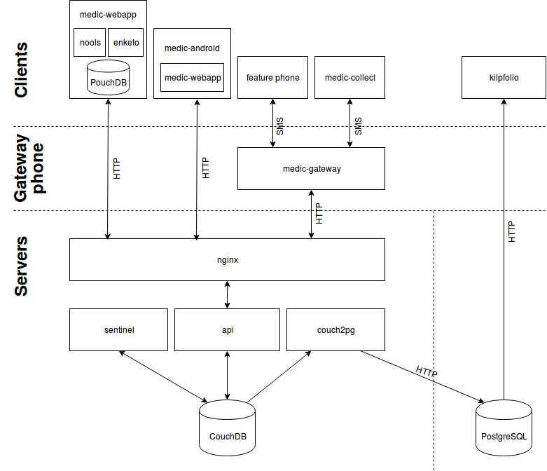

# Architecture of Medic Mobile instances

This page gives details on the different pieces of a Medic Mobile instance, how they interact and what they're used for.

## Overview

Medic Mobile instances are machines running [MedicOS](#medic-os), on which runs [medic-webapp](#medic-webapp) on a CouchDB server. In front of it there's [medic-api](#medic-api) (node api server) as an interface to the outside world, with nginx in front. [Medic-sentinel](#medic-sentinel) is a background processing helper on the server. [medic-gateway](#medic-gateway) sends and receives SMS messages for the server.

Users can access the webapp through a browser, or through [medic-android](#medic-android), or use SMS tools like [Medic Collect](#other-tools), SimApp or directly SMS.

## [medic-os](https://github.com/medic/medic-os/)

Yes, we have an OS. How cool is that.

MedicOs is an embedded image that's small enough to download in the remotest places. It contains a linux-based operating system, along with startup scripts, service management scripts, and software packages to run the Medic Mobile stack.

It powers the production servers, and the [DIY toolkit](http://medicmobile.org/diy).

## [medic-webapp](https://github.com/medic/medic-webapp/)

Medic Mobile's brain. It's a [CouchDB](http://couchdb.apache.org/) app ([Why did Medic Mobile choose CouchDB?](http://medicmobile.org/blog/why-did-medic-mobile-choose-couchdb)), built with [kanso](https://github.com/kanso/kanso).

The server code is a [couchapp](http://couchapp.readthedocs.io/en/latest/intro/what-is-couchapp.html). The client code, served by CouchDB, is in [AngularJS](https://angularjs.org/).

Most users, whether on desktop or mobile, replicate the couchdb database locally via [PouchDB](https://pouchdb.com/), a JS database in the browser. This allows them to work offline and have their DB state automatically synced with the server, using Couch's 2-way replication. A given user only gets the data relevant to them (filtered replication).

Admins, who oversee all data on the webapp and work online, interact directly with CouchDB. They don't replicate data in a local DB to avoid having excessively large quantities of data pulled down.

The webforms are powered by [Enketo](https://enketo.org/).
We use the [nools](https://github.com/C2FO/nools) rules engine to compute the upcoming tasks and monthly targets of the users.

For more information about the format of docs in the database, see [Database Schema](db_schema.md).

## [medic-api](https://github.com/medic/medic-api/)

A node server which deals with authentication, authorization, and does some processing of requests when needed.
It also runs a more efficient implementation of filtered replication.

On prod systems, nginx runs in front of it for SSL and compression.

## [medic-sentinel](https://github.com/medic/medic-sentinel/)

A node program that runs on the server, listens to changes and edit docs if needed. It processes incoming SMS reports : validation, generation of unique patient ids, generation of the schedule of outgoing messages triggered by the report, attach contact info to the report.

Instances that only have android users (no SMS) do not use sentinel ([all transitions are disabled](https://github.com/medic/medic-sentinel#transitions-configuration-examples)).

## [medic-gateway](https://github.com/medic/medic-gateway/)

Medic Gateway is an android app for sending and receiving SMS messages. There's one instance running per project. It polls a medic-api endpoint to write incoming SMS into the db and retreive outgoing SMS to send.

## [medic-android](https://github.com/medic/medic-android/)

Thin native Android app to load medic-webapp in a webview. It makes medic-webapp look like a native android app. Used by Community Health Workers (CHWs) and their local managers.

## Other tools
[Garden Dashboard](https://github.com/garden20/dashboard) is a CouchApp also running on prod instances. It connects to the online Garden Market where we push the new versions of the code, and pulls them from there.

[medic-couch2pg](https://github.com/medic/medic-couch2pg/) is a process for copying the db data into a postgres database, which can be used for readonly analytics queries.

[Medic Collect](https://github.com/medic/medic-collect) is an android app based on [Open Data Kit](https://opendatakit.org/) to send reports in to medic-webapp over SMS or mobile data.

A SimApp (thin chip inserted under the SIM card) can also be used to provide a basic menu for sending reports over SMS. Or the user can type an SMS directly. See [Tools for Basic Phones](http://medicmobile.org/tools).

[medic-reporter](https://github.com/medic/medic-reporter) is a helper tool for testing the sending and receiving of reports without having to use real SMS. It's a couchapp.

